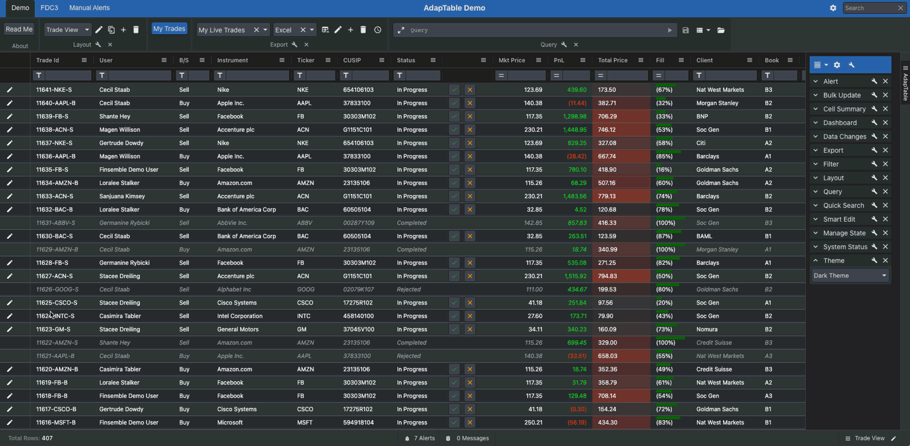

# AdapTable FDC3 Integration Showcase




This is a very basic example of FDC3 interop capabilities in AdapTable.

It provides a small [AdapTable React](https://docs.adaptabletools.com/learn/react-overview) instance which contains some dummy Instrument data.

The example illustrates some of  AdapTable's [FDC3 capabilities](https://docs.adaptabletools.com/guide/handbook-using-fdc3).

### FDC3 Columns
The demo contains 3 [FDC3 Columns](https://docs.adaptabletools.com/guide/handbook-using-fdc3-columns):

- `Instrument`:
  - broadcasts the corresponding [Instrument](https://fdc3.finos.org/docs/context/ref/Instrument) context (via ContextMenu)
- `Ticker`:
  - raises an Intent for the corresponding [Instrument](https://fdc3.finos.org/docs/context/ref/Instrument) context (via ContextMenu)
- `Contact`:
  - raises the [StartChat](https://fdc3.finos.org/docs/intents/ref/StartChat) Intent for the corresponding [Contact](https://fdc3.finos.org/docs/context/ref/Contact) (via ContextMenu)

### Available FDC3 Intents Listeners
The demo listens to 3 FDC3 Intents:
- [ViewInstrument](https://fdc3.finos.org/docs/intents/ref/ViewInstrument)
  - it filters the existing trades by the given Instrument Ticker
  - e.g. `{
    type: "fdc3.instrument",
    id: {
      ticker: "MSFT"
    }
    }`
- [ViewContact](https://fdc3.finos.org/docs/1.2/intents/ref/ViewContact)
  - it filters the existing trades by the given Contact email
  - e.g. `{
    type: "fdc3.contact",
    id: {
    email: "test@mail.com"
    }
    }`
- [ViewQuote](https://fdc3.finos.org/docs/1.2/intents/ref/ViewQuote)
  - logs the context

### Finance Plugin
All AdapTable FDC3 logic is defined declaratively in the [Finance Plugin](https://docs.adaptabletools.com/guide/reference-plugins-overview#finance)

The code to define the FDC3 Columns and Intents is:

```
const financeOptions: FinancePluginOptions = {
  fdc3Columns: {
    instrumentColumns: [
      {
        columnId: 'instrument',
        nameColumnId: 'instrument',
        tickerColumnId: 'ticker',
        cusipColumnId: 'cusip',
        showBroadcastContextMenu: true,
      },
      {
        columnId: 'ticker',
        nameColumnId: 'instrument',
        tickerColumnId: 'ticker',
        cusipColumnId: 'cusip',
        showRaiseIntentForContextMenu: true,
        raiseIntentForContextMenuLabel: ({ gridCell }) => {
          return `Raise Intent for ${gridCell.displayValue}`;
        },
      },
    ],
    contactColumns: [
      {
        columnId: 'user',
        nameColumnId: 'user',
        emailColumnId: 'userEmail',
        intents: ['StartChat'],
      },
    ],
  },
  availableFDC3Intents: ['ViewQuote', 'ViewInstrument', 'ViewContact'],
  onFDC3Intent: (intent: any, context, adaptableApi) => {
    const { type } = context;
    adaptableApi.systemStatusApi.setInfoSystemStatus(
      `IN :: Intent (${intent}, ${type})`,
      JSON.stringify(context)
    );
  },
  onFDC3Context: (context, adaptableApi) => {
    const { type } = context;
     adaptableApi.systemStatusApi.setSuccessSystemStatus(
      `IN :: Context Broadcast(${type})`,
      JSON.stringify(context)
    );
    handleIncomingContextBroadcast(context, adaptableApi);
  },
};
```

## Installation

Run `npm install` (or `yarn`), depending on what tool you're using.

## Running for development

Execute the following command

```sh
$ npm run start
```

## Licences

A licence for AdapTable provides access to all product features as well as quarterly updates and enhancements through the lifetime of the licence, comprehensive support, and access to all 3rd party libraries.

We can make a trial licence available for a short period of time to allow you to try out AdapTable for yourself.

Please contact [`sales@adaptabletools.com`](mailto:sales@adaptabletools.com) or read the [Licence Documentation](https://docs.adaptabletools.com/licensing) for more information.

## Demo

To see AdapTable in action visit our [Demo Site](https://demo.adaptabletools.com). Here you can see a large number of AdapTable demos each showing a different feature, function or option in AdapTable (using dummy data sets).

## Help

Developers can learn how to access AdapTable programmatically at [AdapTable Documentation](https://docs.adaptabletools.com).

For more information on how to integrate FDC3 in Adaptable see the [FDC3 AdapTable Documentation](https://docs.adaptabletools.com/guide/handbook-using-fdc3)

For full information on how to use the AdapTable React Wrapper see the [AdapTable React Documentation](https://docs.adaptabletools.com/learn/react-overview).


## More Information

General information about Adaptable Tools is available at our [Website](http://www.adaptabletools.com)

## Support

For all support enquiries please email [`support@adaptabletools.com`](mailto:support@adaptabletools.com) or [raise a Support Ticket](https://adaptabletools.zendesk.com/hc/en-us/requests/new).
